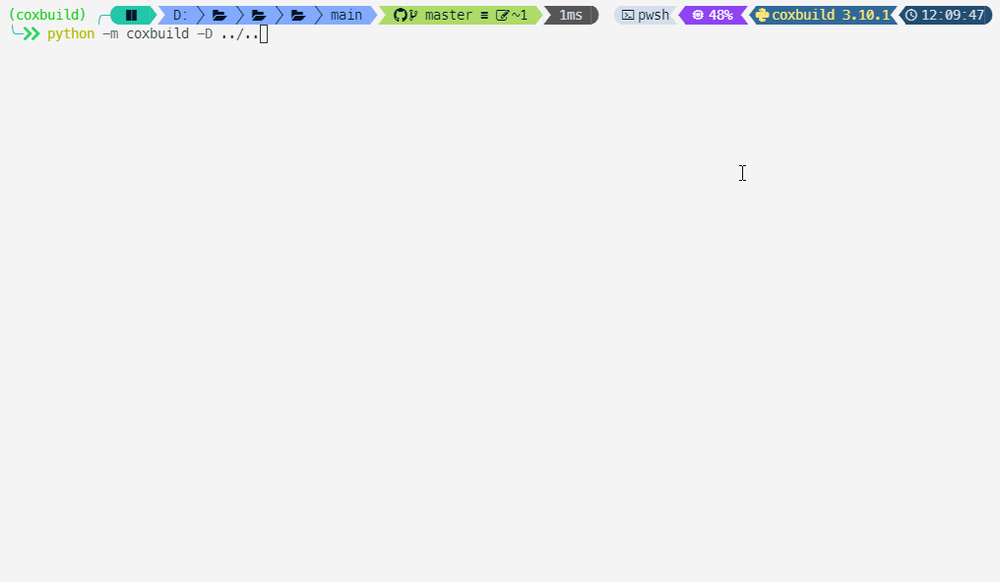

    

Coxbuild is a tiny python-script-based build automation tool, an alternative to make, psake and so on.

> [References](https://stardustdl.github.io/coxbuild/api/)

> [Test Coverage Report](https://stardustdl.github.io/coxbuild/cov/)

Supported features:

- Task
- Dependency
- Pre / Post condition
- Lifecycle hooks
  - Setup / Teardown
  - Before / After
- Event-based build as a long-run service
- Multiple schema sources
  - File `file://`
  - Url `url://`
  - Source code `src://`
  - Module `mod://`
  - Gallery `ext://`

Extensions:

- Python
- Shell
- Git
- Node.js
- .NET
- Gradle
